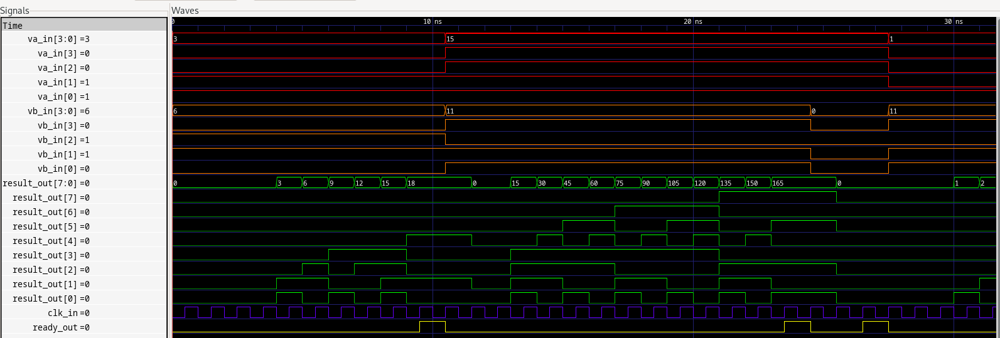

# PCS3225

Conhecimentos ocultos e aleatórios para os projetos de SD2.

---

Prof. Marco

---

## Livros
-   [free range vhdl](https://github.com/fabriziotappero/Free-Range-VHDL-book)

## Projeto Zero

Multiplicador

## Quartus
Outra via para fazer simulações e também serve para gravar na FPGA
[Intel Quartus](https://www.intel.com/content/www/us/en/products/details/fpga/development-tools/quartus-prime.html)

## Atividade de Fixação 1

Para fazer a leitura do arquivo externo `multiplicador_tb.dat`, nós

- Colocamos os componentes do multiplicador numa pasta
- Importamos ∫'mente a biblioteca `std.textio`
- Vinculamos a leitura do arquivo ao começo do process
- Transformamos os textos em sinais internos
- Atribuimos o sinais às entradas do `multiplicador.vhd`
- Comparamos a saida com a terceira coluna do arquivo `.dat`

## Aula 4

### 1

- Bit é um valor binário
- Uma célula de memória é o menor valor de um armazenamento digital
- Palavra de memória é conjuntos de bits que é manipulados simultaneamente.
- Endereço é o sinal que é enviado para memória que localiza uma palavra.
- Byte, 8 bits
- Capacidade, é o produto entre o número de palavras e o tamanho da palavra
- Tempo de acesso é o intervalo de tempo entre a estabilização do sinal de seleção do endereço e a saída da informação da memória.

### 2

1 Mb vale 1 000 000 000 bytes, 1 Mib vale 1 073 741 824 (2^30) bytes.
A diferença é de quase 74 milhões de bytes.

### 3
- O número de palavras é
- Tamanho da palavra em bytes
- E a capacidade é

### 4
Os principais sinais de controle de uma ROM são

### 5
Os principais sinais de controle de uma RAM são

### 6 
Duas diferenças entre SRAM e DRAM

### 7 
É preciso fazer ciclos de _refresh_ na DRAM pois
